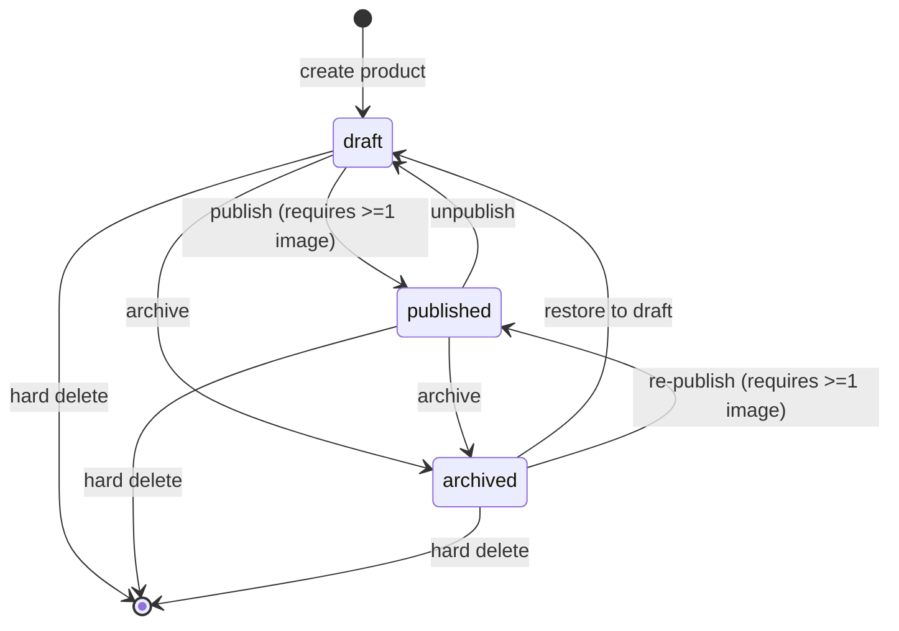
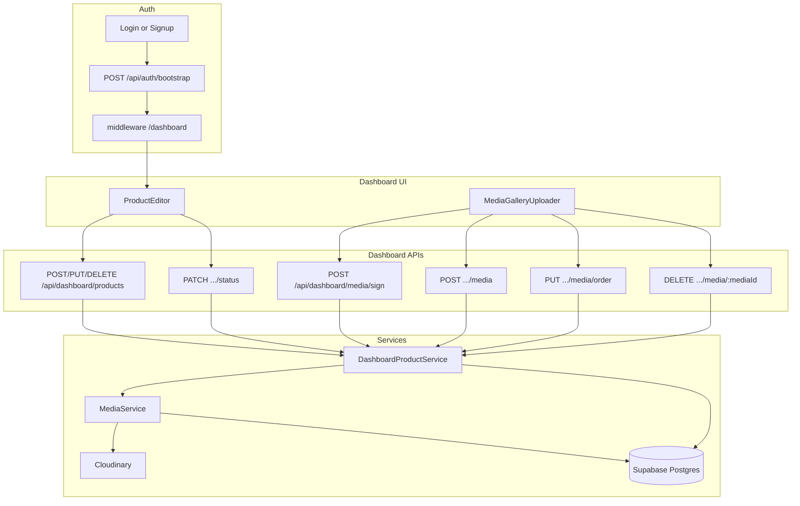

# Product Lifecycle

**Audience:** Anyone building Feed, Store, Search, Orders, or dashboard features  
**Status:** Reference for Phase 3+  
**Source of truth in code:** `DashboardProductService`, `ProductStatus` enum, `MediaAsset`

---

## 1. Status model

Products use Prisma enum `ProductStatus`:

| Status | Meaning | Visible on public surfaces |
|--------|---------|----------------------------|
| `draft` | Work in progress; editable | No |
| `published` | Live catalog item | Yes (Store, Home, Category, Feed cards, PDP) |
| `archived` | Removed from active selling | No (retained for history / designer reference) |

Default on create: **`draft`**.

---

## 2. State transitions



### Rules (implemented)

| Transition | Allowed? | Guard |
|------------|----------|-------|
| → `published` | Yes | At least one **image** in the product gallery |
| → `draft` | Yes | Always (unpublish / restore) |
| → `archived` | Yes | Always |
| Delete | Yes | Owner only; see §4 |

API: `PATCH /api/dashboard/products/:id/status` with `{ "status": "draft" | "published" | "archived" }`.

UI: Save + Draft / Publish / Archive actions on the product editor; Publish/Unpublish shortcuts on the products list.

---

## 3. Media lifecycle

Gallery source of truth: **`media_assets`** (`MediaAsset`), keyed by `productId`.

`Product.images` (string[]) is a **synced cache** of ordered image `secureUrl`s for public PDP/cards. Cover = first image after order sync (`displayOrder === 0` among gallery items; image URLs only in `Product.images`). Public DTOs prefer `MediaAsset` by `displayOrder` and fall back to `Product.images`.

### Upload

```
1. Ensure product exists (create/save draft)
2. POST /api/dashboard/media/sign  → signed Cloudinary params
3. Browser uploads file to Cloudinary (progress / cancel via XHR abort)
4. POST /api/dashboard/products/:id/media
      → ownership check
      → max images / videos enforcement
      → duplicate publicId rejection
      → MediaService.registerUpload
      → sync Product.images
```

Limits (env):

- `MEDIA_MAX_IMAGES_PER_PRODUCT` (default 10)
- `MEDIA_MAX_VIDEOS_PER_PRODUCT` (default 3)

Cloudinary folder default: `designers-street/products`.

### Reorder

```
PUT /api/dashboard/products/:id/media/order
body: { "mediaIds": ["…", "…"] }  // full permutation
→ set displayOrder = index
→ sync Product.images
```

**Cover image:** item at index `0` (first in `mediaIds`). Prefer an image as cover for publish UX; publish only requires any image somewhere in the gallery.

### Delete media

```
DELETE /api/dashboard/products/:id/media/:mediaId
→ delete DB row + Cloudinary asset
→ reindex displayOrder 0..n-1
→ sync Product.images
```

### Video

- Stored as `kind = video` with `durationMs`, optional `thumbnailUrl` (Cloudinary still).
- Videos do not enter `Product.images[]`; they remain on `MediaAsset` for future players / feed.

---

## 4. Soft delete vs hard delete

**Chosen approach: hard delete for dashboard product removal.**

When a designer deletes a product:

1. Each linked `MediaAsset` is deleted (DB + Cloudinary best-effort).
2. The `Product` row is removed (`ProductRepository.delete`).

There is **no** `deletedAt` column today. “Remove from store but keep record” is modeled as **`archived`**, not soft delete.

| Intent | Mechanism |
|--------|-----------|
| Hide from customers, keep for designer | `status = archived` |
| Permanently remove product + media | Hard delete via `DELETE /api/dashboard/products/:id` |

Future orders that reference products should rely on **order line snapshots** (already sketched on `OrderItem`) so hard-deleting a product later does not erase purchase history. Until Orders ship, prefer **archive** over delete for anything that may have been sold.

---

## 5. Ownership model

```
Supabase Auth user
    └── User.id = auth.uid
            └── DesignerHouse.ownerUserId = User.id
                    └── Product.designerId = DesignerHouse.id
                            └── MediaAsset.productId = Product.id
```

### Enforcement

- Middleware: session required for `/dashboard/*`.
- APIs: `requireDashboardContext()` loads User + owned `DesignerHouse`.
- Mutations: `assertOwned(product.designerId, ctx)` — client-supplied `designerId` is **ignored**.
- Admins (`role = admin`) may manage any product (same assert allows admin).

Designers never manage another house’s catalog through these APIs.

---

## 6. How public & future features consume products

**Public visibility helper** (`public-visibility.ts`): `status === published` AND designer `accountStatus === active`. Used by all public product/feed queries. Non-visible PDP → 404.

| Feature | Reads | Filter | Media |
|---------|-------|--------|-------|
| **Store / PLP / PDP / Home** | `PublicCatalogService` → DTOs | Visibility helper + filters/cursor | Prefer `MediaAsset` by `displayOrder`, fallback `Product.images` |
| **Feed** | Published products mapped to `FeedPostDTO` | Same visibility; newest first | Cover → `image`; product tag uses cover |
| **Search** (not built) | Same published set | Full-text / filters | Thumb = cover image URL |
| **Orders** (not built) | Snapshot name/price/image on `OrderItem` | Purchasable only if `published` | Copy cover URL into line item |
| **Designer dashboard** | All statuses for owned house | Owner session | Full gallery CRUD |

Cutover flags: `USE_DATABASE` + `NEXT_PUBLIC_USE_API`. When either is off, storefront uses mock / `DataContext`.

---

## 7. API flow diagram



### Typical publish path

1. `POST /api/dashboard/products` → draft  
2. Sign + Cloudinary upload + register media (repeat)  
3. Optional reorder (cover first)  
4. `PATCH .../status` `{ "status": "published" }`  
5. Public Store/Feed/PDP query via `PublicCatalogService` (visibility helper)

---

## 8. Invariants (do not break)

1. Never publish without ≥1 image.  
2. Never trust client `designerId` / `productId` for authorization without session ownership check.  
3. Keep `Product.images` in sync after any gallery mutation.  
4. Public surfaces must ignore `draft` and `archived` until explicitly designed otherwise.  
5. Prefer **archive** over hard delete once Orders exist.  
6. Cloudinary API secret stays server-side only.

---

## Related docs

- [system-architecture.md](./system-architecture.md) — system entry point  
- [phase-4.md](./phase-4.md) — public marketplace  
- [phase-3.md](./phase-3.md) — dashboard implementation  
- [phase-2.md](./phase-2.md) — media foundation  
- [architecture-decisions.md](./architecture-decisions.md) — locked product decisions  
