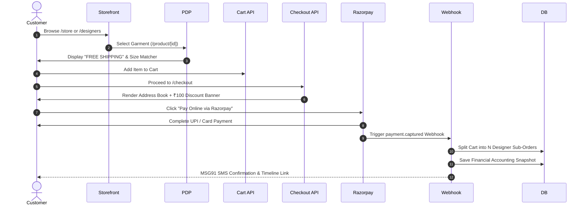
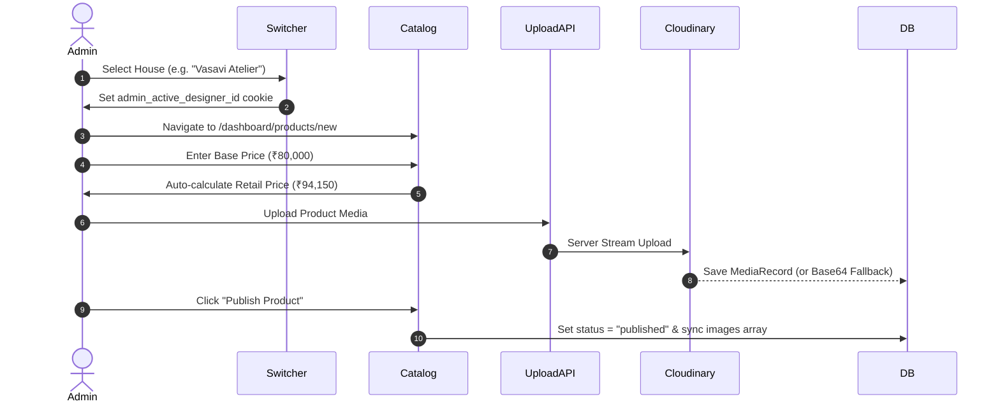
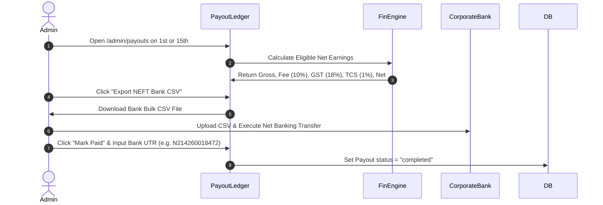

# 09 — User Flows & Sequence Diagrams

## 1. Customer Shopping & Checkout Flow

```mermaid
sequenceDiagram
    autonumber
    actor Customer
    participant Storefront
    participant PDP
    participant Cart API
    participant Checkout API
    participant Razorpay
    participant Webhook
    participant DB

    Customer->>Storefront: Browse /store or /designers
    Storefront->>PDP: Select Garment (/product/[id])
    PDP->>Customer: Display "FREE SHIPPING" & Size Matcher
    Customer->>Cart API: Add Item to Cart
    Customer->>Checkout API: Proceed to /checkout
    Checkout API->>Customer: Render Address Book + ₹100 Discount Banner
    Customer->>Razorpay: Click "Pay Online via Razorpay"
    Razorpay->>Customer: Complete UPI / Card Payment
    Razorpay->>Webhook: Trigger payment.captured Webhook
    Webhook->>DB: Split Cart into N Designer Sub-Orders
    Webhook->>DB: Save Financial Accounting Snapshot
    Webhook-->>Customer: MSG91 SMS Confirmation & Timeline Link
```

---

## 2. Admin Multi-House Management Flow

```mermaid
sequenceDiagram
    autonumber
    actor Admin
    participant Switcher
    participant Catalog
    participant UploadAPI
    participant Cloudinary
    participant DB

    Admin->>Switcher: Select House (e.g. "Vasavi Atelier")
    Switcher->>Admin: Set admin_active_designer_id cookie
    Admin->>Catalog: Navigate to /dashboard/products/new
    Admin->>Catalog: Enter Base Price (₹80,000)
    Catalog->>Admin: Auto-calculate Retail Price (₹94,150)
    Admin->>UploadAPI: Upload Product Media
    UploadAPI->>Cloudinary: Server Stream Upload
    Cloudinary-->>DB: Save MediaRecord (or Base64 Fallback)
    Admin->>Catalog: Click "Publish Product"
    Catalog->>DB: Set status = "published" & sync images array
```

---

## 3. Bi-Monthly NEFT Payout Flow (1st & 15th)

```mermaid
sequenceDiagram
    autonumber
    actor Admin
    participant PayoutLedger
    participant FinEngine
    participant CorporateBank
    participant DB

    Admin->>PayoutLedger: Open /admin/payouts on 1st or 15th
    PayoutLedger->>FinEngine: Calculate Eligible Net Earnings
    FinEngine->>PayoutLedger: Return Gross, Fee (10%), GST (18%), TCS (1%), Net
    Admin->>PayoutLedger: Click "Export NEFT Bank CSV"
    PayoutLedger->>Admin: Download Bank Bulk CSV File
    Admin->>CorporateBank: Upload CSV & Execute Net Banking Transfer
    Admin->>PayoutLedger: Click "Mark Paid" & Input Bank UTR (e.g. N214260018472)
    PayoutLedger->>DB: Set Payout status = "completed"
```
